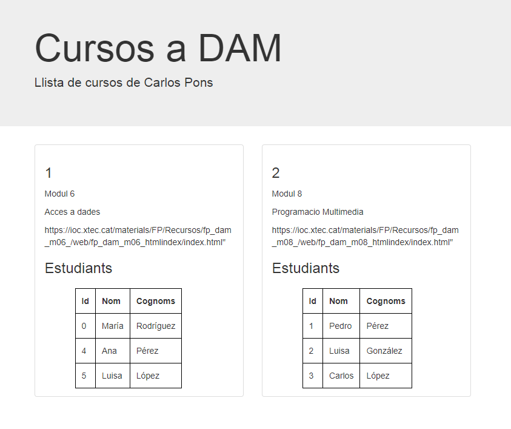

Per què hem utilitzat l’Autowired dins el controlador a l’hora de referir-nos al servei?
  - Hem utilitzat l'anotació @Autowired dins del controlador perquè ens permet injectar                 automàticament el servei CursService, evitant la necessitat de crear manualment una instància i     simplificant la gestió de les dependències. Aquesta anotació fa que el contenidor d'injecció de     dependències de Spring busqui una instància vàlida de CursService i la injecti en el controlador     quan sigui necessari. Això ens proporciona una instància del servei a l'hora de referir-nos a       ell en el controlador, sense haver de gestionar la seva creació explícitament.
